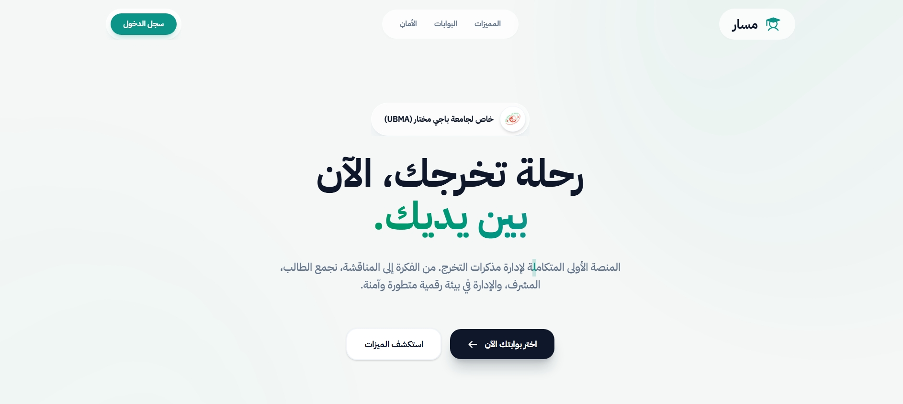
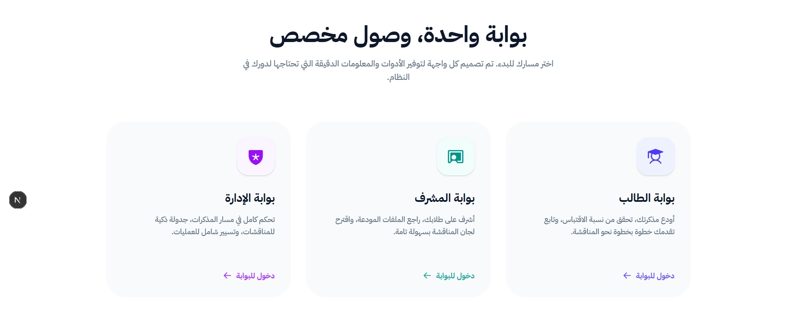
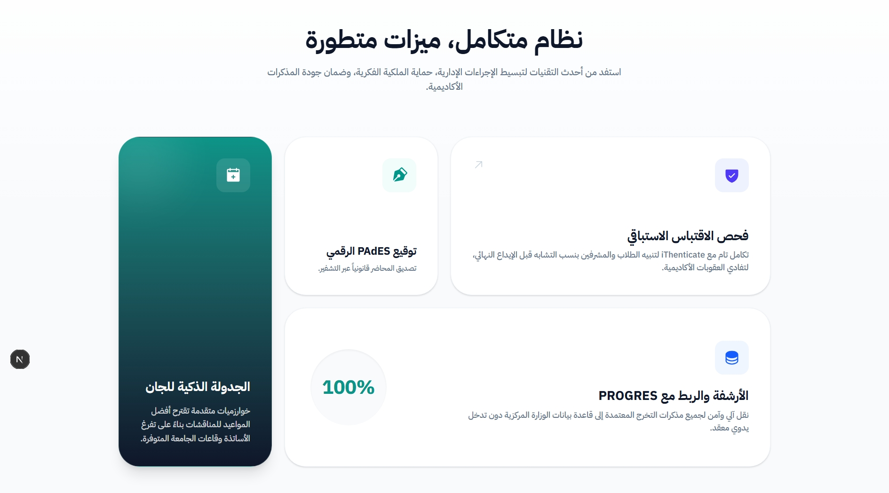

# Massar — مسار

<div align="center">
  

**A Comprehensive Platform for University Thesis Management**  
 **المنصة المتكاملة لإدارة مذكرات التخرج الجامعية**

[](https://opensource.org/licenses/MIT)
[](https://nextjs.org/)
[](https://reactjs.org/)
[](https://tailwindcss.com/)
[](https://supabase.com/)

</div>

---

## Overview

Massar is a modern academic platform built to digitize and streamline the thesis management lifecycle in universities. It connects students, supervisors, and administrators within a single, unified environment — replacing fragmented, paper-based workflows with a transparent and traceable digital process.

---

## Features

**Role-Based Dashboards**  
Each user type — student, supervisor, or administrator — accesses a tailored interface with real-time progress tracking and relevant actions.

**Plagiarism Detection**  
Integrated scientific integrity checks allow students and supervisors to verify work before final submission.

**Intelligent Scheduling**  
Defense sessions, room assignments, and jury compositions are managed automatically, reducing administrative overhead.

**Internal Messaging**  
A built-in real-time chat system facilitates direct, documented communication between students and their supervisors.

**Digital Document Signing**  
Official reports and documents can be signed electronically, eliminating the need for physical paperwork.

**Instant Notifications**  
Stakeholders receive timely alerts for any update to thesis status, deadlines, or scheduled events.

---

## Tech Stack

### Frontend

| Layer      | Technology                   |
| ---------- | ---------------------------- |
| Framework  | Next.js 16 (App Router)      |
| UI Library | React 19                     |
| Styling    | Tailwind CSS 4               |
| Animations | Framer Motion                |
| Icons      | Phosphor Icons, Lucide React |

### Backend

| Layer          | Technology               |
| -------------- | ------------------------ |
| Server         | Express.js (Node.js)     |
| Language       | TypeScript               |
| Database       | Supabase (PostgreSQL)    |
| Authentication | Supabase Auth            |
| File Storage   | Supabase Storage, Multer |

---

## Getting Started

### Prerequisites

- Node.js v18 or higher
- npm or yarn
- A Supabase project

### Installation

**1. Clone the repository**

```bash
git clone https://github.com/ruxiit/Massar.git
cd Massar
```

**2. Configure the backend**

```bash
cd massar-backend
npm install
```

Create a `.env` file inside `massar-backend/`:

```env
PORT=5000
SUPABASE_URL=your_supabase_url
SUPABASE_SERVICE_ROLE_KEY=your_service_role_key
```

**3. Configure the frontend**

```bash
cd ../massar-frontend
npm install
```

Create a `.env.local` file inside `massar-frontend/`:

```env
NEXT_PUBLIC_API_URL=http://localhost:5000/api
NEXT_PUBLIC_SUPABASE_URL=your_supabase_url
NEXT_PUBLIC_SUPABASE_ANON_KEY=your_anon_key
```

### Running Locally

```bash
# Backend
cd massar-backend && npm run dev

# Frontend
cd massar-frontend && npm run dev
```

---

## Screenshots

<div align="center">
  <h3>Hero Section</h3>
  

  <br/>

  <h3>Portals Overview</h3>
  

  <br/>

  <h3>Key Features</h3>
  
</div>

---

## License

This project is licensed under the [MIT License](https://opensource.org/licenses/MIT).  
Developed and maintained by [@ruxiit](https://github.com/ruxiit).
